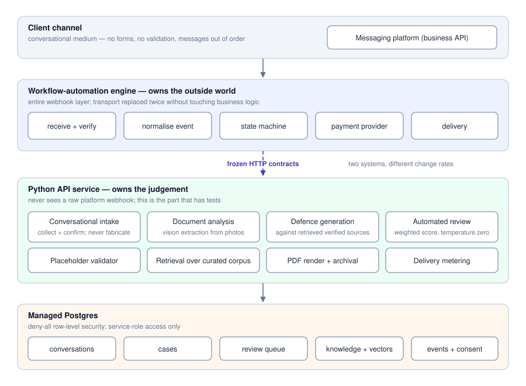
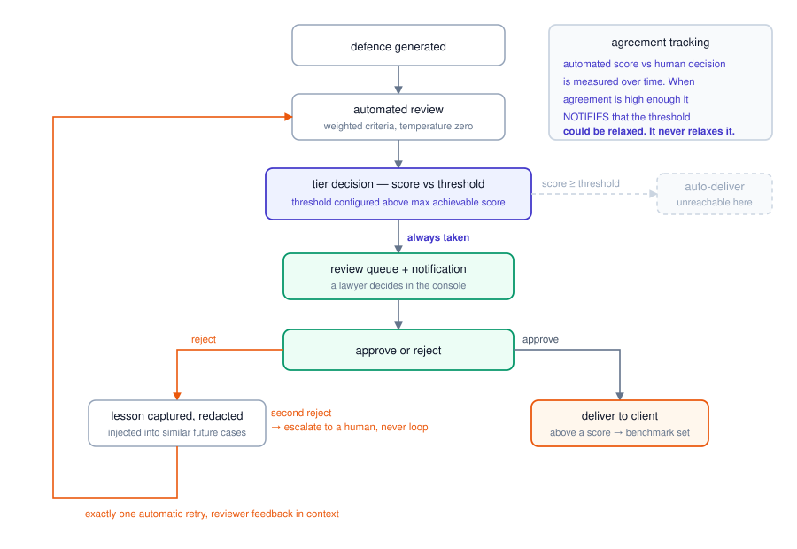
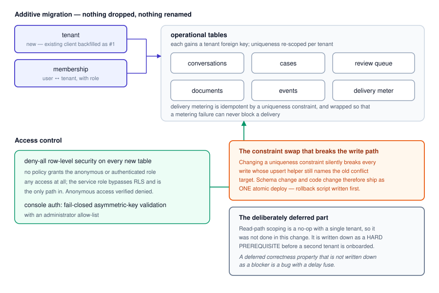

# Caça Multas — a document-generation system a law firm actually lets near its clients

**What it is:** a WhatsApp-first pipeline that takes a Brazilian traffic-fine notice, collects
the documents and the payment, generates a written administrative defence, scores it,
routes it through a human lawyer, and delivers the approved document back to the client.

**Status:** deployed and in daily use by a real traffic-fine defence law firm in northern
Brazil `[CM-1: verified]`. The firm is not named here — no consent to name it is on file.

**Why it is the case study I lead with:** almost none of the difficulty was in getting a
model to write a decent defence. It was in making a system that a lawyer will put their
name on, that keeps working when a managed database silently pauses, and that can be handed
to the client to own.

---

## 1. The problem

Traffic-fine defence in Brazil is high-volume, low-margin, deadline-bound legal work. A
firm's economics are set by how many defences a lawyer can review per hour, not by how many
a system can generate. Any tool that produces plausible legal text but shifts the review
burden upward makes the firm slower, not faster.

Three constraints followed from that, and they shaped every decision below:

1. **A wrong document is worse than no document.** An administrative defence citing a
   repealed article, or a court decision that does not exist, is worse than the client
   filing nothing — it burns a deadline.
2. **The lawyer is the bottleneck, and must stay in the loop.** The goal is not to remove
   the review. It is to make the review fast and to make the reviewer's decisions worth
   something to the system.
3. **The client's channel is WhatsApp.** Not a portal, not email. Which means the whole
   intake — identity documents, vehicle registration, the fine notice itself, payment — has
   to survive a conversational medium with no forms and no validation.

## 2. Discovery — what changed after contact with real clients

The first design was a deterministic state machine: ask for field, validate field, advance.
It was correct and people hated it. Real intake messages arrive out of order, in bulk, as
photos, with corrections three messages later.

Replacing it with a conversational LLM intake fixed the experience and introduced a new,
worse failure: the agent would fill required fields with plausible-looking placeholder text
rather than admit it had not been told. A defence generated from invented identity data is
exactly the class of output constraint (1) forbids.

The fix was not a better prompt. It was three mechanical changes:

- **Persist the user's turns**, not just the assistant's. The root cause of the invented
  values was that the agent's own history was missing the side of the conversation that
  contained the real answers.
- **A validator between intake and generation** that rejects bracketed placeholder markers
  outright, and enforces per-field shape — identifier digit counts, postcode length, plate
  format, email shape — before any document is generated.
- **An explicit confirmation step** that reads the collected values back to the client and
  will not advance without a yes.

The conversational intake shipped behind an environment-variable kill switch, with the old
deterministic state machine one command away. That switch was not decoration: it existed
because I did not trust the new path, and it stayed because I still think that is the right
default for anything an LLM drives in front of a paying client.

## 3. Architecture, at pattern level

The system splits along one line: **the workflow engine owns the outside world; the
application owns the judgement.**

- A self-hosted **workflow-automation engine** is the entire webhook layer. It receives the
  messaging-platform events, normalises them, drives the state machine, calls the payment
  provider, and performs delivery. The application service never sees a raw platform
  webhook.
- A **Python API service** owns the agents and the business rules: conversational intake,
  document analysis, retrieval, defence generation, automated review, PDF rendering, case
  archival, metering.
- A **managed Postgres** instance holds conversations, cases, the review queue, the legal
  knowledge base and its vector index, event logs and consent records.

Four model-backed roles, each with a narrow job:

| Role | Job |
|---|---|
| Conversational intake | Collect and confirm client data over chat; never fabricate a field |
| Document analysis | Vision-model extraction from photographed fine notice, licence, registration |
| Defence generation | Write the administrative defence against retrieved strategies, statutes and verified citations |
| Automated review | Score the generated defence on weighted criteria at temperature zero, so scoring is reproducible |

Retrieval is over a curated legal knowledge base rather than the open web: argument
strategies anchored to current statutory article numbers, plus jurisprudence and doctrine
rows that carry a verification flag.

**Why the split.** Putting the webhook layer in the workflow engine meant the messaging
transport could be replaced twice (see §5) without touching a line of the application's
business logic. Putting the judgement in a normal Python service meant the parts that
needed tests could have tests. The seam is a small number of HTTP contracts, deliberately
frozen — I treat them as an interface between two systems with different change rates, not
as an implementation detail.

## 4. The safety choices, and what each one cost

### The review gate is a configuration, not a promise

Every generated defence flows through the automated reviewer, then a tier decision, then a
review-queue item, then a notification, then a wait, then an approve-or-reject decision in
the console, and only then to delivery.

The deployment sets the auto-deliver threshold **above the maximum achievable score**. The
practical effect is that no document reaches a client without a lawyer approving it
`[CM-2: verified]`.

I want to be precise about what that claim is, because the honest version is less
impressive than the marketing version: **this is a configuration of the deployment, not an
invariant of the code.** The code's default threshold is an ordinary score gate. If someone
lowers the configured value, documents can auto-deliver. That is why the value is written
down in the handover, why the analytics that would justify lowering it are notify-only, and
why lowering it is gated on a separate check described below.

The cost of the gate is real: every document costs reviewer minutes, and the system's
throughput is the firm's review capacity. That was the correct trade at launch and I would
make it again.

### Rejections are worth something

A reject is not just a stop. It is captured as a lesson, redacted of personal data, and
injected into generation for similar future cases. It also triggers exactly one automatic
retry with the reviewer's feedback in context; a second rejection escalates to a human
rather than looping. Approvals above a score are promoted into the benchmark set as gold
examples.

Agreement between the automated reviewer and the human decisions is tracked. When agreement
is high enough over enough decisions, the system **notifies** that the threshold could be
relaxed. It never relaxes it. A system that can widen its own autonomy on its own evidence
is a system that will eventually widen it for the wrong reason.

### Citations cannot be invented, because unverified ones do not exist

The original knowledge base contained citations that could not be traced. The remediation
was to verify each one and **delete the ones that failed** rather than flag them, and then
make retrieval filter to verified rows only. Fail-closed: an unverifiable citation is not
a warning in the output, it is absent from the corpus `[CM-3: verified]`.

Strategies were separately re-anchored to current article numbers after a statutory
renumbering — a reminder that a legal knowledge base has a maintenance schedule the way a
dependency tree does.

### The re-entry bug — a safety bypass that no test would have caught

The most instructive bug in the project: while a case was in the processing state, any
further client message re-fired generation and review, and on one path re-sent the
document — bypassing the review gate that was the entire safety story.

It was found by an adversarial re-verification **against the live workflow definition, not
the version in the repository**, because the exported copies in the repository were stale.
The immediate exposure was closed by the review-gate wiring; the residual re-triggering was
closed by a marker guard on the trigger node.

Two things I took from it. First, for a system whose behaviour partly lives in a hosted
workflow engine, the repository is not the source of truth about production — fetch the
live definition before you reason about it. Second, the invariant now written into the
handover is not "the gate works" but **"confirm the guard is live before ever lowering the
threshold"** — a conditional, in the place someone will actually read it.

### Everything else that had to be true

A security review before launch turned up the ordinary, boring, fatal things, and they were
fixed as a block: row-level security enabled and deny-all on every public table with
service-role bypass verified and anonymous access denied; console auth moved to fail-closed
asymmetric-key validation with an administrator allow-list; the internal error-reporting
endpoint moved behind a bearer token; cross-origin access narrowed from a wildcard to an
allow-list; per-sender rate limiting and prompt-injection sanitisation on the conversational
endpoint; a personal-data-redacting log filter; a consent notice in the greeting with a
consent record written; and a host firewall, where previously there was none.

## 5. Four production incidents

`[CM-6: verified]` — each of these has a written write-up and a resolution.

### 5.1 The database paused and the health check lied

The managed Postgres project was on a tier that auto-pauses after a stretch of idle time.
It paused. The pipeline was database-dead for days while the health endpoint kept returning
green, because the endpoint checked the process, not its dependencies.

Fix: the health check performs a real dependency probe, and a scheduled canary workflow
polls it and alerts on degradation. The general lesson is the one everybody knows and
nobody implements until it bites: **a health check that cannot fail is a monitoring
liability**, and the failure it hides is always the silent kind.

### 5.2 A timezone bug that looked like a payment-provider outage

Payment date and due date were computed with a UTC date string. Near UTC midnight, the
Brazilian local date is still the previous day, and the payment provider rejected the
values. The symptom was a payment confirmation arriving hours late — presenting as a
flaky third-party integration.

Fix: explicit timezone on both date computations, plus an error-output branch on the
payment node routed to a friendly retry message. Before the fix, a provider glitch produced
silence for the client; after it, it produces a message.

### 5.3 The unofficial messaging transport lost its session

The first transport was an unofficial library-based WhatsApp bridge. It lost its device
session in a way that could not be recovered, which is a failure mode that library class
has by design. The response was to migrate the transport to the platform's official
business API — a different auth model, a different webhook shape, a different delivery-status
model — and to build the second transport as a parallel workflow so the migration could be
staged rather than cut over blind.

### 5.4 The cross-border messaging block, and why the fix was organisational

After the migration, replies to Brazilian recipients failed with a cross-border messaging
error. The number was healthy, the account was healthy, the webhook subscriptions were
correct.

Diagnosing it took discipline more than skill. The evidence chain: the outbound send got a
message ID, the failure arrived asynchronously on the delivery-status webhook, and only for
Brazilian recipients — which meant **inbound was never blocked, only the reply**. That
distinction matters when you explain it to a non-technical client, because "we cannot
receive messages" and "we cannot reply" imply completely different fixes.

Two independent sources converged on the cause: the restriction lives at the
**business-portfolio domicile level**, not at the number or the messaging-account level. The
portfolio was domiciled in Australia. There is no exception, no appeal, and no escalation
path; a support ticket confirmed it in writing.

The first attempted fix — creating a Brazil-domiciled portfolio myself under the client's
company registration and submitting the client's identity document — was rejected, and the
rejection was textbook: the identity document at the verification step must belong to the
person performing the verification. No document swap fixes an ownership mismatch.

**So the fix stopped being technical.** The validated design is full delegation: the client
creates and verifies their own business portfolio under their own company registration from
their own account; I join as a collaborator with scoped, revocable access; a new application
is created inside the client's portfolio, which makes the integration first-party and
removes the entire review process that made every other path a dead end; a least-privilege
system user in the client's portfolio holds the token; billing is the client's, in the
client's currency, attached only after the account's currency and timezone are set, because
those lock.

That is written up as a phased roadmap with owner tags on every step — client, me, or
either — plus a plain-language version in the client's own language so the steps only they
can perform are steps they can actually perform `[CM-7: verified]`.

The reason I lead with this incident rather than a model-quality one: **the interesting
constraint in a deployed AI system is frequently not the model.** It is a platform policy
that no amount of engineering can route around, and the deliverable is a migration plan a
non-technical client can execute.

## 6. Operating the client's own infrastructure

The delegation above is the sharp end of a design position I now hold generally: for a
system that lives on a client's channels, in a client's jurisdiction, under a client's
company registration, **the client should own the accounts and I should hold revocable
access.**

It is worse for me in every short-term way. It is more setup, more coordination, more steps
that block on somebody else's calendar. It is better on every axis that matters over a
year: the client is not hostage to my accounts, the compliance posture matches who actually
operates the business, and my access can be withdrawn without the system stopping.

The same instinct produced the multi-tenant work. Making the system multi-firm meant an
additive schema migration — a tenant table, a membership table, tenant foreign keys on the
operational tables, backfilling the existing client as tenant one — with uniqueness scoped
per tenant and deny-all row-level security on the new tables `[CM-8: verified]`.

The engineering lesson from that migration is one I would put on a wall. **Swapping a
uniqueness constraint silently breaks the write path**, because the upsert helper names the
old conflict target; the moment the constraint changes, every conversation write fails.
Schema change and code change were therefore treated as one atomic deploy, with a rollback
script written before the migration ran and a re-runnable shadow proof against a copy of
the database. And the read path was deliberately *not* scoped in the same change — with a
single tenant, every row belongs to that tenant, so the scoping is a no-op — but the
deferral is written down as a **hard prerequisite before a second tenant is onboarded**,
not as a nice-to-have. A deferred correctness property that is not written down as a
blocker is a bug with a delay fuse.

Delivery metering was added in the same change: one event row per delivered document, made
idempotent by a uniqueness constraint, wrapped so a metering failure can never block a
delivery. Billing correctness is worth less than delivery correctness, and the code should
say so.

## 7. What is measured, and what is not

**Measured** `[CM-5]`: 271 commits, 31 pull requests, 609 test functions in the private
repository. The test metric is occurrences of `def test_` in Python sources; collection
reports more because of parametrisation, and a handful require credentials. I re-counted
all three while writing this page rather than quoting an older document.

**Verified** — the properties in §4 and §6: the review-gate configuration, verified-only
citations, deny-all row-level security, fail-closed auth, the incident write-ups. These are
code-and-config reads, not measurements.

**Unknown, and the honest gaps** `[CM-9]`: case volume, reviewer approve/reject counts, and
the AI↔human agreement rate. The system records all three and exposes them on an endpoint.
I have not read them, so I do not quote them. **I have no legal outcome data and no win
rate** `[CM-10]`, and I will not have any until the firm reports outcomes back over a long
enough window. **I have no revenue or ROI figure** `[CM-11]` and will not publish one.

**Designed, not measured** `[CM-12]`: a document-quality metric set exists on paper — zero-edit
approval rate, reviewer edit distance, generated-versus-human score comparison, critical
defect count as a hard invariant, citation verification rate, reviewer minutes per document.
Targets are specified. The instrumentation to read them is planned work. Until then that is
a design, and calling it a result would be a lie.

**Withheld** `[CM-4]`: the reviewer-calibration run has a number I remember and a stored
output I could not locate while writing this. So the number is not here. The harness exists
and can be re-run.

## 8. What I would do differently

**Instrument the outcome metrics on day one, not after launch.** The metrics in `[CM-12]`
were specified early and instrumented late, which is why §7 has an "unknown" column at all.
A quality claim you cannot read is not a quality claim.

**Verify against the live definition from the start.** The re-entry bug survived because the
exported workflow in the repository had drifted from production. Anything whose behaviour
lives partly in a hosted engine needs a fetch-and-diff step in the review loop, not an
assumption that the export is current.

**Resolve the platform's jurisdictional constraints before building on the platform.** The
cross-border block cost more calendar time than any technical problem in the project, and
it was fully discoverable in advance from the platform's own policy documents. I now treat
"whose legal entity owns the account, and in what country" as an architecture question
asked in week one.

**Choose the official transport first even when the unofficial one is faster.** The
library-based bridge shipped sooner and cost a migration.

**Write the health check against the dependency, always.** Everything else in §5.1 follows
from that one line.
