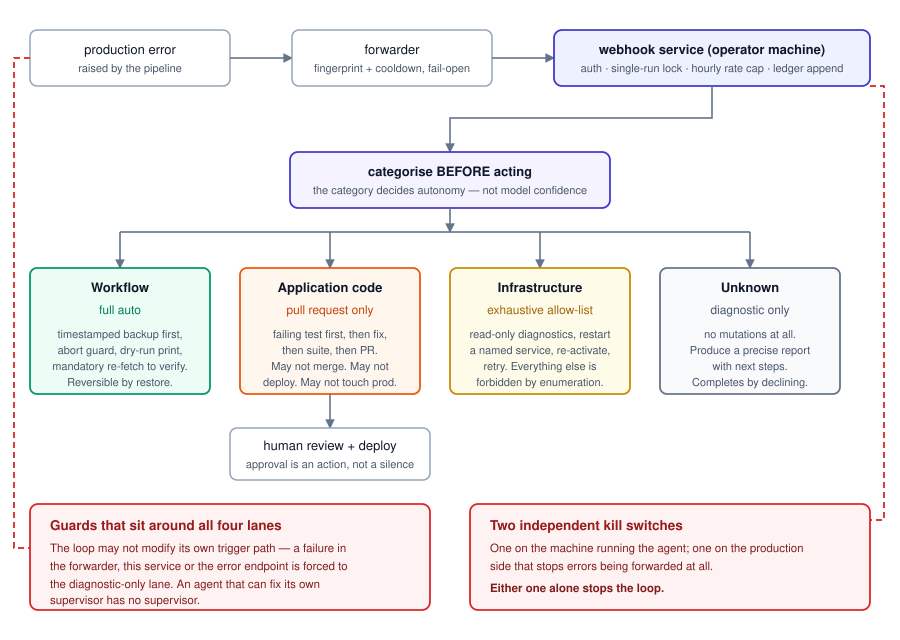

# The autonomous remediation loop — 15 production runs, and what the ledger does not say

**Status of this page:** a summary. A runnable extract of this loop — the forwarder, the
webhook service with a mock runner, the policy file and the ledger — is planned as its own
repository. This page is not a link to it, because it does not exist yet. When it does, this
page becomes the write-up and the link.

**What it is:** when the traffic-fine pipeline in [`caca-multas.md`](caca-multas.md) raises
an error, a forwarder posts a fingerprinted report to a webhook service on a machine I
control. That service authenticates the call, takes a lock, checks a rate cap, appends a
ledger row, and spawns a headless coding agent with a policy document telling it what it is
and is not allowed to do about that class of error.

---

## Why build it at all

A single-operator production system has a specific failure mode: the operator is asleep, or
at their day job, and a paused dependency or a stopped container costs hours of silence
before anyone looks. The interesting question was not "can an agent fix a bug" — it was
**how much autonomy can you give an agent against production before the expected cost of its
mistakes exceeds the cost of the downtime it prevents.**

The answer I arrived at is: it depends entirely on the category of the failure, and the
category has to be decided before the agent gets to act.

## The graduated autonomy policy

`[FX-2: verified]` — this is the whole design, and it is four rules.

| Category | Autonomy | Rationale |
|---|---|---|
| **Workflow** | Full auto | Changes are to a hosted workflow definition. Read-modify-write with a timestamped backup taken first, an abort guard, a dry-run print, and a mandatory re-fetch to verify. Reversible by restoring the backup. |
| **Application code** | Pull request only, never deploy | The agent works in a clone, writes a failing test first, fixes, runs the suite, opens a PR. It may not merge, may not deploy, may not touch the server. A human reviews and deploys. |
| **Infrastructure** | Exhaustive allow-list | Read-only diagnostics, restarting a named service, starting a stopped one, re-activating a workflow, retrying an execution. Everything else is forbidden by enumeration — no version control on the server, no editing files or environment, no removing anything, no reboots, no database writes outside the error table, no reading or rotating secrets. |
| **Unknown** | Diagnostic only | No mutations. Produce a precise report with next steps. |

The list of forbidden actions is written as an exhaustive enumeration rather than a
principle, and that is deliberate. "Use good judgement about infrastructure" is not a
policy an agent can be held to. "You may run exactly these commands" is.

Three more guards sit around it:

- **The loop cannot modify its own trigger path.** If the failure is in the forwarder, the
  webhook service, or the error endpoint itself, it is forced to the diagnostic-only
  category. An agent that can fix its own supervisor has no supervisor.
- **Concurrency, rate and cooldown limits.** One run at a time via a lock file with a
  staleness override, a maximum number of runs per hour, and a fingerprint cooldown upstream
  so a flapping error cannot spawn a queue of agents.
- **Two independent kill switches**, one on the machine running the agent and one on the
  production side that stops errors being forwarded at all. Either alone stops the loop.

Every deploy that results from an application-code fix ends with a literal command a human
has to send. Approval is an action, not a silence.

## The ledger

`[FX-1: measured]` — the loop appends one row per run with five fields and no free text:
run identifier, start time, finish time, category, outcome. That shape is why it can be
published at all; there is nothing in it to redact.

**15 runs, 2026-07-19 to 2026-08-30, all recorded as completed.**

| # | Date | Category | Duration (min) | Outcome |
|---|---|---|---|---|
| 1 | 2026-07-19 | unknown | 4.5 | completed |
| 2 | 2026-07-24 | infrastructure | 5.8 | completed |
| 3 | 2026-07-26 | infrastructure | 2.4 | completed |
| 4 | 2026-07-28 | workflow | 5.4 | completed |
| 5 | 2026-07-29 | unknown | 1.5 | completed |
| 6 | 2026-07-29 | unknown | 1.4 | completed |
| 7 | 2026-07-29 | unknown | 1.2 | completed |
| 8 | 2026-08-01 | infrastructure | 2.7 | completed |
| 9 | 2026-08-06 | infrastructure | 1.9 | completed |
| 10 | 2026-08-10 | infrastructure | 1.6 | completed |
| 11 | 2026-08-10 | unknown | 7.6 | completed |
| 12 | 2026-08-14 | infrastructure | 1.9 | completed |
| 13 | 2026-08-16 | infrastructure | 5.2 | completed |
| 14 | 2026-08-16 | workflow | 5.9 | completed |
| 15 | 2026-08-30 | infrastructure | 1.8 | completed |

Totals: infrastructure 8, unknown 5, workflow 2, application code 0. Durations 1.2–7.6
minutes.

## What the ledger does not say

This is the part I care most about getting right, because the table above is very easy to
over-read.

**"Completed" means the agent finished its run and produced a structured report.** It does
not mean the incident was resolved. For the five `unknown` runs it explicitly means the
opposite: the policy forced a diagnostic-only outcome, so the run completed *by declining to
act*. That is the system working as designed, and it is a third of the runs.

**Zero application-code fixes ever ran.** The category that would be most impressive is the
category that never fired. Every fix in that window was infrastructure or a workflow
definition — which is, on reflection, exactly what you would expect: the code was under test
and the environment was not.

**There is no counterfactual** `[FX-3: unknown — never claimed]`. I cannot tell you that any
of these runs fixed something faster, better or more cheaply than I would have. There was no
control, no baseline mean-time-to-recovery, and no measurement of what a human would have
taken. A three-minute agent run against an incident nobody was awake for is not evidence of
a three-minute saving; it is evidence of a three-minute agent run.

**The sample is small and self-selected.** Fifteen runs on one system operated by the person
who wrote the policy. It is enough to say the guard rails hold. It is not enough to say the
approach generalises.

## What I would take to another system

The transferable part is not the code. It is the shape:

1. **Categorise before you act, and let the category decide the autonomy** — not the model's
   confidence in the moment.
2. **Enumerate the allowed actions for the highest-risk category.** Prohibition by principle
   does not survive contact with a plausible-sounding rationalisation.
3. **Deny the loop authority over itself.**
4. **Make the approval an action.** No timeouts that decay into consent.
5. **Log a schema, not a narrative.** Five typed fields with no free text is a ledger you can
   publish, audit and count. A log full of model prose is neither.
